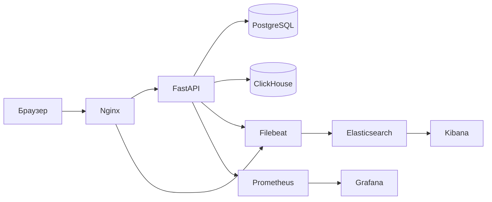

# L2 Incident Lab

Интерактивный учебный стенд в Docker Compose для расследования L2-инцидентов
на пути HTTP-запроса. В проекте есть реальный API заказов, управляемые сценарии
сбоев, коррелированные логи, метрики и проверка результата в базах данных.

▶️ [Посмотреть демонстрацию проекта](https://youtu.be/BVqWKvMX6h4?si=RhVcNvNf6JKJ2ypu)

## Что демонстрирует проект

- диагностику HTTP-запроса через Nginx, FastAPI и PostgreSQL;
- корреляцию событий по `X-Request-ID`;
- расследование ответов HTTP 500, 502, 504 и 429;
- поиск бизнес-ошибки, скрытой за успешным HTTP 201;
- KQL-запросы в Kibana;
- метрики Prometheus и автоматически загружаемый dashboard Grafana;
- проверку данных в PostgreSQL и аналитику событий в ClickHouse;
- сбор доказательств, эскалацию и оформление баг-репортов.

## Архитектура



PostgreSQL — источник истины для заказов. ClickHouse хранит только аналитические
события. Подробнее: [архитектура](docs/architecture.md).

## Требования

- Docker Engine с плагином Compose;
- не менее 4 ГБ свободной оперативной памяти для полного стека;
- свободные порты `8080`, `3000`, `5601`, `9090`, `9200` и `8123`.

Порты можно изменить в `.env`; доступные переменные находятся в `.env.example`.

## Быстрый запуск

```bash
cp .env.example .env
docker compose up --build -d
docker compose ps
```

Дождитесь состояния `running` или `healthy` у постоянных сервисов. Два setup-
контейнера должны завершиться с кодом 0 после настройки Elasticsearch и Kibana.

Откройте <http://localhost:8080>.

Остановка:

```bash
docker compose down
```

Удаление контейнеров вместе с накопленными данными:

```bash
docker compose down -v
```

## Сервисы

| Сервис | Адрес | Примечание |
|---|---|---|
| Investigation Console | <http://localhost:8080> | Основной интерфейс |
| Swagger UI | <http://localhost:8080/docs> | Интерактивная документация API |
| Метрики backend | <http://localhost:8080/metrics> | Формат Prometheus |
| Grafana | <http://localhost:3000> | По умолчанию `admin` / `admin` |
| Prometheus | <http://localhost:9090> | Targets и PromQL |
| Kibana | <http://localhost:5601> | Data view `L2 Incident Lab Logs` |
| Elasticsearch | <http://localhost:9200> | Локальный endpoint |
| ClickHouse HTTP | <http://localhost:8123> | Аналитический endpoint |
| PostgreSQL | `localhost:5433` | Доступен только через loopback |

Для любого окружения кроме локального стенда замените стандартные пароли.

## Сценарии

| Режим | Ответ | Ожидаемые доказательства | Повтор |
|---|---:|---|---|
| `normal` | 201 | Заказ сохранён со статусом `created` | Не нужен |
| `bad_gateway` | 502 | Nginx не подключился к upstream; backend не получил POST | После восстановления |
| `slow_api` | 504 | Nginx прекратил ожидание на 3-й секунде; backend может завершить операцию позднее | Сначала проверить БД |
| `rate_limited` | 429 | Предупреждение backend и `Retry-After: 30` | Соблюсти `Retry-After` |
| `api_error` | 500 | Ошибка backend; заказ не создан | Эскалация с `request_id` |
| `invalid_status` | 201 | Заказ сохранён с бизнес-статусом `UNKNOWN` | Считать бизнес-ошибкой |

Активный режим хранится в памяти backend и сбрасывается в `normal` при его
перезапуске. Подробнее: [описание сценариев](docs/incident-scenarios.md).

## Главное самостоятельное расследование: HTTP 504

1. В интерфейсе выберите **HTTP 504 Gateway Timeout**.
2. Создайте один заказ с уникальными данными.
3. Зафиксируйте HTTP-код, задержку и `request_id`.
4. Не повторяйте запрос.
5. В Kibana выполните:

   ```kql
   request_id : "<REQUEST_ID>"
   and method : "POST"
   and path : "/api/orders"
   ```

6. Подождите не менее 10 секунд и выполните SQL-запрос из интерфейса.
7. Сопоставьте 504 от Nginx, позднее завершение backend и строку в PostgreSQL.
8. Решите, безопасно ли повторять POST.

Главный вывод: таймаут означает неопределённый результат, а не гарантированный
провал. Backend может завершить операцию после ответа 504, поэтому слепой повтор
создаёт риск дубля. Полная процедура:
[L2-runbook](docs/l2-incident-runbook.md).

## Примеры API

```bash
curl -i http://localhost:8080/api/health

curl -i -X POST http://localhost:8080/api/orders \
  -H 'Content-Type: application/json' \
  -H 'X-Request-ID: demo-request-001' \
  -d '{"customer_name":"Иван","product":"Клавиатура","quantity":1}'

curl -i http://localhost:8080/api/orders
```

Все ответы API содержат `X-Request-ID`. Те же запросы можно выполнить через
Swagger UI без отдельного API-клиента.

## Наблюдаемость

Prometheus собирает метрики FastAPI. Поэтому ответы 500 и 429 видны в HTTP-
метриках backend. Коды 502 и 504 формирует Nginx: они видны в его логах и
Kibana, но отсутствуют в счётчиках FastAPI. Стенд намеренно не подделывает
proxy-метрики.

Filebeat собирает помеченные Docker-логи Nginx и FastAPI. Шаблон индекса
Elasticsearch и data view Kibana создаются автоматически.

```bash
docker compose logs nginx backend
curl -s http://localhost:9090/api/v1/targets
curl -s http://localhost:9200/_cluster/health
```

## Документация

- [Архитектура](docs/architecture.md)
- [Сценарии инцидентов](docs/incident-scenarios.md)
- [L2-runbook](docs/l2-incident-runbook.md)
- [Поиск логов в Kibana](docs/log-search.md)
- [Баг-репорты и JQL](docs/bug-reports-and-jql.md)
- [SQL для PostgreSQL](diagnostic_queries/postgresql.sql)
- [SQL для ClickHouse](diagnostic_queries/clickhouse.sql)
