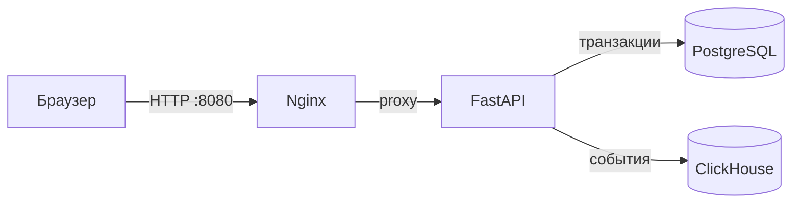
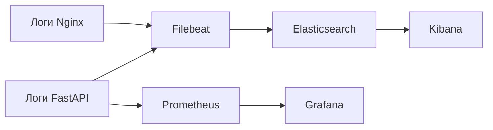

# Архитектура

## Путь запроса

| Компонент | Ответственность |
|---|---|
| Интерфейс | Включает сценарий, отправляет реальный запрос и показывает доказательства |
| Nginx | Раздаёт frontend, проксирует API, добавляет correlation ID и формирует 502/504 |
| FastAPI | Валидирует запросы, применяет сценарии, сохраняет заказы и отдаёт метрики |
| PostgreSQL | Источник истины для заказов и истории статусов |
| ClickHouse | Аналитическая лента событий, но не транзакционный источник истины |

## Путь наблюдаемости

`X-Request-ID` связывает ответ браузеру, access-событие Nginx, событие backend,
строку PostgreSQL и событие ClickHouse. Если клиент не передал заголовок, его
создаёт Nginx или FastAPI.

## Важная граница

Prometheus собирает метрики FastAPI, а не Nginx. Поэтому сформированные
приложением 500 и 429 видны в метриках FastAPI, а сформированные Nginx 502 и 504
видны только в логах Nginx. Это намеренно показывает, что метрики нужно
интерпретировать с учётом места их сбора.
